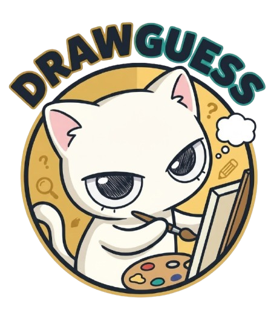

<div align="center">



# 🎨 DrawGuess

### *Vẽ hình đoán chữ cùng bạn bè — realtime, vui hết nấc!*

[](https://nextjs.org)
[](https://socket.io)
[](https://www.typescriptlang.org)
[](https://tailwindcss.com)

</div>

---

## ✨ Tính năng

- 🏡 **Tạo & tham gia phòng** — tạo phòng riêng, chia sẻ mã code cho bạn bè
- 🎭 **Chọn nhân vật** — 16 avatar dễ thương để thể hiện cá tính
- 🖌️ **Vẽ realtime** — canvas đồng bộ tức thì cho tất cả người chơi
- 💬 **Chat & đoán chữ** — gõ đáp án vào chat, đoán đúng là có điểm ngay
- 🏆 **Bảng xếp hạng** — điểm tính theo tốc độ đoán, ai nhanh thì nhiều điểm hơn
- 🎵 **Nhạc nền** — bật/tắt nhạc tùy thích, tự dừng khi vào game
- 👑 **Host controls** — chủ phòng toàn quyền bắt đầu game
- ⚡ **Realtime hoàn toàn** — dùng WebSocket, không cần refresh

---

## 🎮 Cách chơi

```
1. 🏠  Vào trang chủ → nhập tên + chọn avatar
2. 🏡  Tạo phòng mới hoặc nhập mã để vào phòng bạn bè
3. ⏳  Chờ đủ 2 người → host bấm "Bắt đầu game"
4. 🖊️  Người vẽ chọn 1 trong 2 từ gợi ý rồi vẽ lên canvas
5. 💬  Người còn lại đoán từ qua chat — đoán đúng = điểm!
6. 🔄  Xoay vòng qua 3 vòng → xem bảng xếp hạng cuối game
```

---

## 🗂️ Cấu trúc dự án

```
📦 root
├── 🖥️  backend/
│   ├── server.js          # Express + Socket.io server
│   └── package.json
│
└── 🌐 my-app/
    ├── app/
    │   ├── page.tsx        # Trang chủ (chọn tên, avatar, tạo/vào phòng)
    │   ├── room/page.tsx   # Phòng chờ
    │   ├── game/page.tsx   # Màn hình game chính
    │   └── layout.tsx      # Root layout + AudioProvider
    ├── components/
    │   ├── Canvas.tsx      # Canvas vẽ realtime
    │   ├── ChatBox.tsx     # Chat & đoán chữ
    │   ├── PlayerList.tsx  # Danh sách người chơi + điểm
    │   └── AudioProvider.tsx # Quản lý nhạc nền toàn app
    ├── store/
    │   └── gameStore.ts    # Zustand global state
    ├── services/
    │   └── socket.ts       # Socket.io client
    └── types/
        └── game.ts         # TypeScript types
```

---

## 🚀 Chạy dự án

### Yêu cầu
- Node.js 18+
- npm hoặc yarn

### 1. Clone & cài dependencies

```bash
git clone <repo-url>

# Backend
cd backend
npm install

# Frontend
cd ../my-app
npm install
```

### 2. Cấu hình môi trường

```bash
# my-app/.env.local
cp .env.local.example .env.local
```

### 3. Khởi động

```bash
# Terminal 1 — Backend (port 5000)
cd backend
node server.js

# Terminal 2 — Frontend (port 3000)
cd my-app
npm run dev
```

Mở [http://localhost:3000](http://localhost:3000) và chơi thôi! 🎉

---

## 🛠️ Tech Stack

| Layer | Công nghệ |
|---|---|
| Frontend | Next.js 15 (App Router) + TypeScript |
| Styling | Tailwind CSS |
| State | Zustand |
| Realtime | Socket.io |
| Backend | Node.js + Express |
| Avatars | DiceBear API |

---

<div align="center">

Made By Huệ Trinh Meo ☕

</div>
